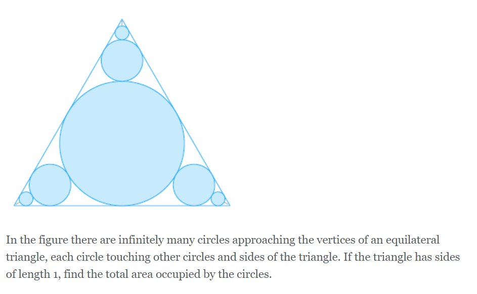

# Infinite Incircle Question

Found this question in my calculus textbook and kept breaking my head on it:



Eventually, I found a [Math StackExchange Thread](https://math.stackexchange.com/questions/945123/infinitely-many-circles-in-an-equilateral-triangle) on how to solve it using a geometric series, however, I had an idea for solving it using some Geometry.

I wanted to pursue this dumb idea instead and see if it got me the same answer.

See, the triangle is an equilateral triangle of side length `1.0`:


Which means that big circle in the center must be the incircle of the triangle. Now, if we look closely, that circle kinda just constructs 3 new equilateral triangles:


So really, we just need to develop a method find the radius of the incircle of any equilateral triangle given its side length.

This can be done using [Heron's Theorem](https://en.wikibooks.org/wiki/Trigonometry/Circles_and_Triangles/The_Incircle)! It gives us a general formula:


Where `s` is the semiperimeter and `a` is the side length of the equilateral triangle.

We keep repeating this for each of the new triangles each incircle creates, and that gives us an infinite series. We can use good old `A = pi * r^2` to find the area of each incircle, and taking an arbitrarily high number of terms in this series will give us a good estimate of the answer!

Of course, actually evaluating the the infinite limit is what the question asks for, which requires a bit of calculus and a geometric series, but this was the idea I had that kept bugging my brain.

Of course, let's compare my answer to the real answer `11*pi / 96`:

```
True Answer: 0.35997415822383044
Your Answer: 0.3599741582238305
```

Success! You can find the script [here](recursive_solver.py)

## References

Simran. (2014, September 25). _Infinitely Many Circles in an Equilateral Triangle_ [Online Forum Post]. Mathematics Stack Exchange. https://math.stackexchange.com/questions/945123/infinitely-many-circles-in-an-equilateral-triangle

Stewart, J. (2015). Calculus: Early Transcendentals (8th ed.). Cengage Learning.

WikiBooks. (2020, June 28). Trigonometry/Circles and Triangles/The Incircle. https://en.wikibooks.org/wiki/Trigonometry/Circles_and_Triangles/The_Incircle
